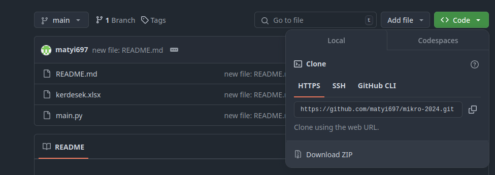

# Mikroelektronika ZH Felkészülés segítő

## Telepítési Útmutató

### 1. Python Telepítése Windows rendszeren

1. **Python letöltése:**
   - Látogass el a [Python hivatalos weboldalára](https://www.python.org/downloads/).
   - Válaszd ki a legújabb verziót, majd kattints a letöltés gombra.

2. **Telepítés:**
   - Nyisd meg a letöltött fájlt.
   - Fontos, hogy a telepítő ablakban pip (Python package installer) opciót is pipáld be. Ez lehetővé teszi a csomagok egyszerű telepítését.

### 2. Python csomagok telepítése

A program futtatásához szükséges csomagok telepítéséhez kövesd az alábbi lépéseket:

1. **Parancssor megnyitása:**
   - Nyisd meg a Start menüt, írd be, hogy "cmd", és nyisd meg a Parancssort.

2. **Csomagok telepítése:**
   - Írd be a következő parancsokat a parancssorba:
     ```bash
     pip install pandas openpyxl
     ```

### 3. Excel fájl előkészítése

- Használd a repoban megadott excel file-t, amelyben a kérdések és a válaszok a következő formátumban szerepelnek:
  - **Oszlop A:** Kérdések
  - **Oszlop B:** Válaszok
  - **Oszlop C:** (üres vagy "tudom" a tudott kérdésekhez)

### 4. A program futtatása

1. **Mentés:**
   - Ezt a repot le tudod tölteni, felül ha rákattintasz a zöld `<>code` gombra és letöltöd zip archívumként.
   

2. **Futtatás:**
   - Navigálj a parancssorban abba a mappába, ahol a `.py` fájl található:
     ```bash
     cd C:\elérési\út\a\mappához
     ```
   - Futassd a programot a következő paranccsal:
     ```bash
     python mikroelektronika.py
     ```

### Használat

- A program indításakor egy kérdés jelenik meg.
- Használj a gombokat a válasz megjelenítésére és a következő kérdésre lépéshez.
- Jelöld meg, hogy tudod-e a kérdést (Tudom) vagy sem (Nem tudom). A program automatikusan frissíti az Excel fájlt a válaszaidnak megfelelően. Ha azt válaszoltad hogy Tudod a kérdést többet nem kérdezi meg.

#### Sok sik kollégák uwu, ha kérdés van nyugodtan nyissatok issue-t itt gitHubon, vagy irjatok.